# API Test Automation Project - Hanzo

This test automation project was developed to validate the endpoint https://jsonplaceholder.typicode.com/users. Uses Robotframework with Python and RequestsLibrary.

# Testing Techniques and Objectives

In this set of automated tests for the API endpoint https://jsonplaceholder.typicode.com/users, we employ various testing techniques to validate the structure and data returned by the API. Each test scenario addresses a specific aspect of the JSON response, ensuring that the data conforms to predefined expectations. Below, I outline the techniques used and the objectives of each test scenario.

## Scenario: JSON Structure Validation

### Description:

- GIVEN that I make a GET request to "/users"
- THEN I validate the JSON structure correctly

### Techniques and Objectives:

- JSON Structure Validation:
    - Objective: Ensure that the JSON response contains all expected fields for each user.
- Technique: Verify that each object in the response array contains the mandatory keys (id, name, username, email, address, phone, website, company). This ensures that the data structure is as expected and no essential fields are missing.

## Scenario: Validation of Specific Values for a User

### Description:

- GIVEN that I make a GET request to "/users"
- THEN the first user must have the name "Leanne Graham"

### Techniques and Objectives:

- Validation of Specific Values:
    - Objective: Confirm that specific data for a user is correct.
- Technique: Verify that the first user in the JSON response has the name field with the value "Leanne Graham". This type of test is useful for validating static or expected data that should be present in the response, ensuring that the information returned by the API is correct and consistent.

## Scenario: List Size Validation

### Description:

- GIVEN that I make a GET request to "/users"
- THEN the user list must contain 10 users

### Techniques and Objectives:

- List Size Validation:
    - Objective: Ensure that the number of returned data items is correct.
- Technique: Verify that the response array contains exactly 10 user objects. This is important to ensure that the API returns the correct number of records and that there are no missing or excessive data.

## Summary of Testing Techniques Used

### JSON Structure Validation:

- Checks for the presence of specific keys in each object of the response array.

### Validation of Specific Values:

- Confirms that certain fields in specific objects contain expected values.

### List Size Validation:

- Ensures that the number of objects in the response array is correct.

## General Objectives of the Tests

### Data Conformity:

- Ensure that the structure and data returned by the API conform to expectations.

### API Reliability:

- Ensure that the API consistently returns correct and complete data, which is crucial for the integrity of systems relying on this API.

### Anomaly Detection:

- Identify any discrepancies or errors in the data returned by the API, such as missing fields, incorrect data types, or unexpected values.

By applying these testing techniques, we can increase confidence in the robustness and reliability of the API, providing a solid foundation for developing applications that depend on this data.

# Project structure

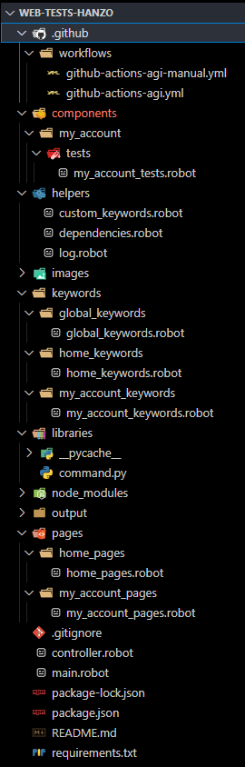

### .github/workflows

- Contains the execution files for GitHub pipeline.

### components

- Contains the test files, by components, to be executed.

###helpers

- Contains configuration files and custom keywords.

### keywords

- Keywords referring to components.

### libraries

- Custom libraries in Python.

### pages

- Page Objects referring to components.

###results

- Result of automated tests.

# Environment Setting

### Installing the latest Java

1. Download the JDK for your platform from [Oracle JDK](https://www.oracle.com/java/technologies/javase-jdk11-downloads.html) or an OpenJDK version of your choice.
2. Install the JDK following the instructions specific to your operating system.
3. Set the `JAVA_HOME` environment variable to point to the directory where the JDK was installed.
4. Add the JDK executable path to the system `PATH`.

### Python Installation

For correct installation of the libraries, _Python_ must be previously installed. Go to [www.python.org/downloads](https://www.python.org/downloads/) and follow the instructions below:

1. Click on the `Download Python 3.10.5` option or the most current version available when accessing the page.

2. Select the `Add Python 3.10 to PATH` option and click `Install Now`.

3. Wait for the installation.

4. Installation complete, click `Close`.

### Installation Robot Libraries Installer

This program aims to assist in installing the libraries necessary for the correct use of the _Robot Framework_ with _Visual Studio Code_.

Download the file [RobotLibrariesInstaller.bat](https://drive.google.com/file/d/1hDVbP7QXGrfOSxW8JUXmyRBSTf6HWnn7/view?usp=sharing) and follow the instructions below:

1. Access the link above and click on the `Download` option.

2. Save the file to your desktop.

3. Right-click on the file icon in question and select `Run as administrator`.

4. Type `1` and click `Enter` on your keyboard.

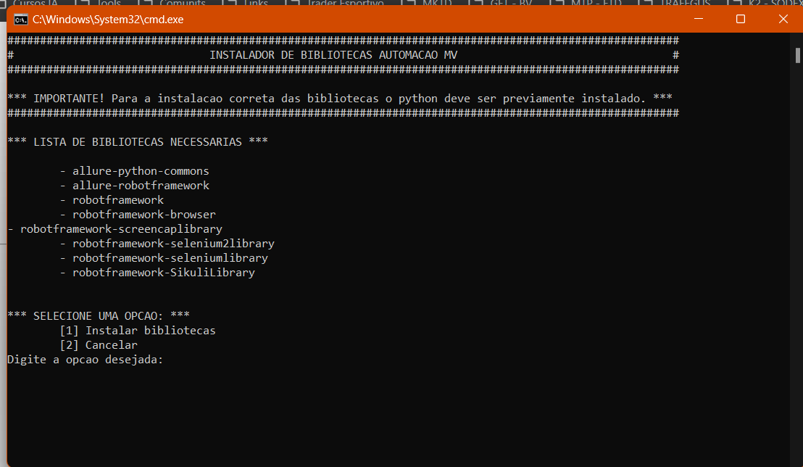

5. Wait for the installation. Afterwards, press any key to exit the installer.

### Visual Studio Code Installation

1. Download Visual Studio Code from [VSCode](https://code.visualstudio.com/download).

### Installation Visual Studio Code Extensions

Open your VSCode and install the following extensions:

1. Pylance.

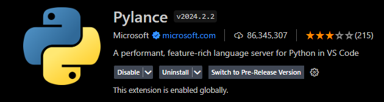

2.Python.


3. Python Debugger.

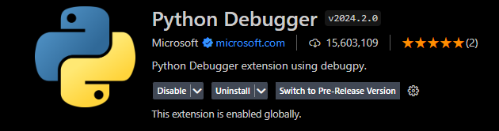

4. Robot Framework Language Server.

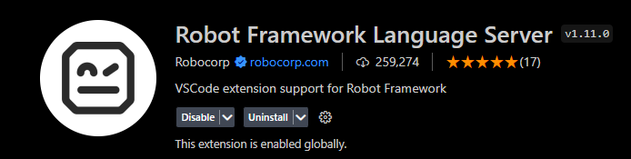

# Cloning the project

1. Clone the [project](https://github.com/hyggedigitaltecnologia/web-tests-hanzo.git) repository.

2. Open the project in your VSCode.

3. Open a terminal in the project root and do the following downloads.

### Installing Node

1. Download NodeJs from [Node](https://nodejs.org/en/download).

### Installing Allure

1. Download Allure by running:

```bash
npm install --save-dev allure-commandline

npx allure-commandline serves
```

2. Close and open your terminal.

# How to run

1. Open a terminal in the project root.

2. Enter the command:

```bash
1. Running the tests:

robot --variable COMPONENT:api/api_get/tests/api_get_tests.robot --variable TAG:api controller.robot

robot --variable COMPONENT:api/api_get/tests/api_get_tests.robot --variable TAG:validation_of_status_code_200 controller.robot

robot --variable COMPONENT:api/api_get/tests/api_get_tests.robot --variable TAG:json_structure_validation controller.robot

robot --variable COMPONENT:api/api_get/tests/api_get_tests.robot --variable TAG:validation_of_specific_values_for_a_use controller.robot

robot --variable COMPONENT:api/api_get/tests/api_get_tests.robot --variable TAG:list_size_validation controller.robot
```

# Generating Allure Report

1. Run the following commands:

```bash
1. allure generate --clean ./output/allure -o allure-report/

2. allure open
```
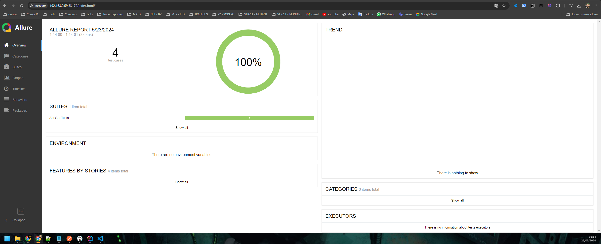

# Running on GitHub Actions

Access [actions](https://github.com/hyggedigitaltecnologia/api-tests-hanzo/actions) and follow the steps:

1. Click on "Manual Run API Tests".

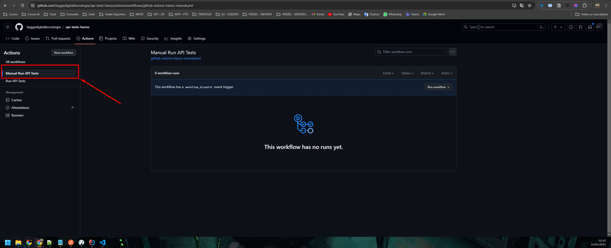

2. Click on "Run workflow".

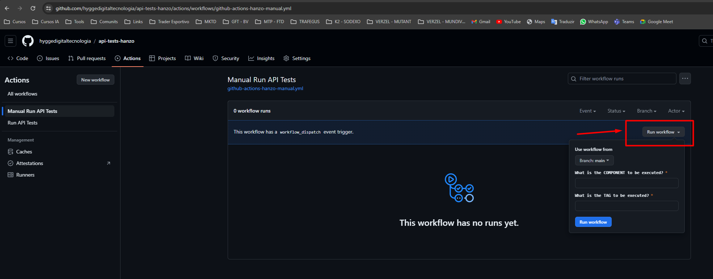

3. Fill in the fields so that and click "Run workflow":

```bash
What is the COMPONENT to be executed?

-> api/api_get/tests/api_get_tests.robot

What is the TAG to be executed?

-> api
```

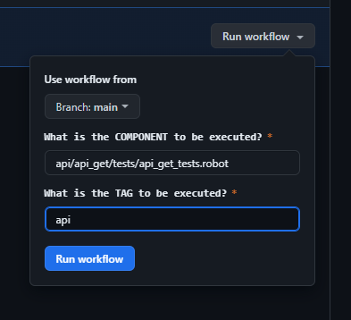

4. Wait for execution.

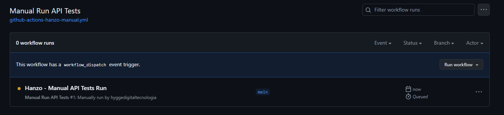

5. Access the run.

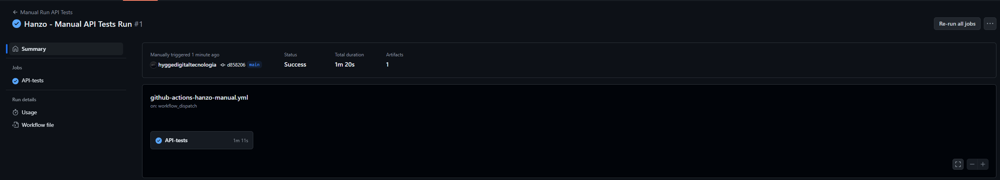

6. Access the downloadable report and execution data.

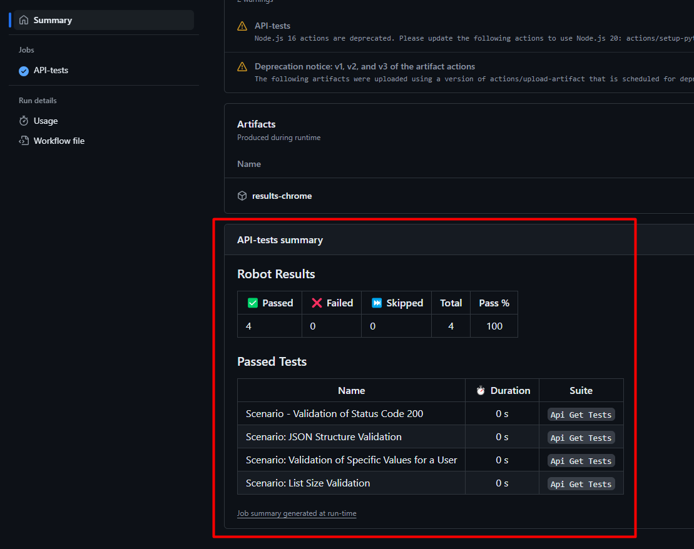